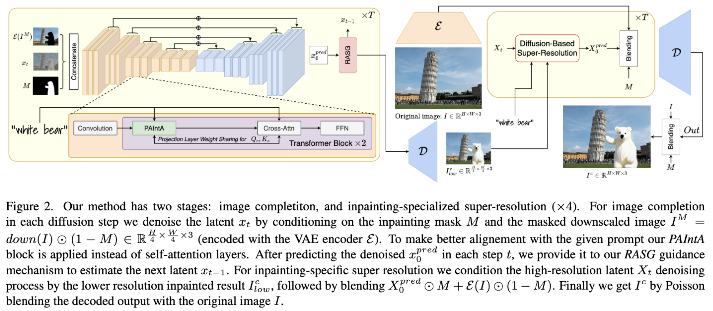
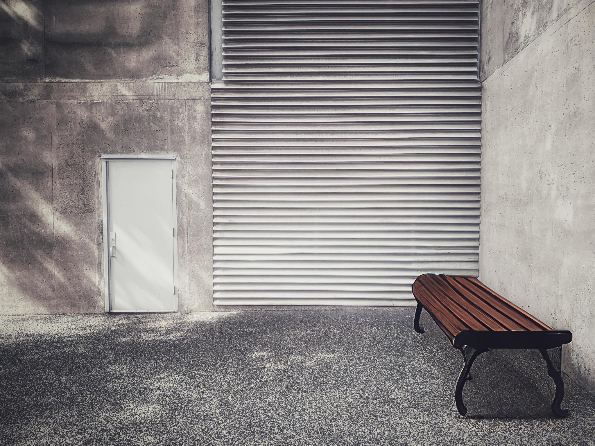
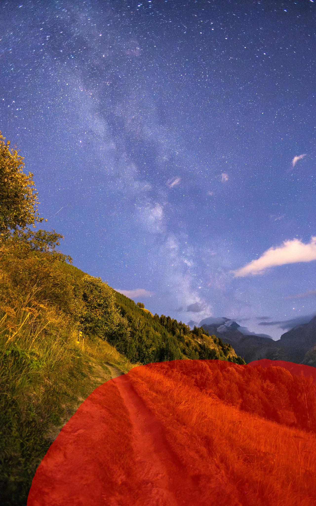
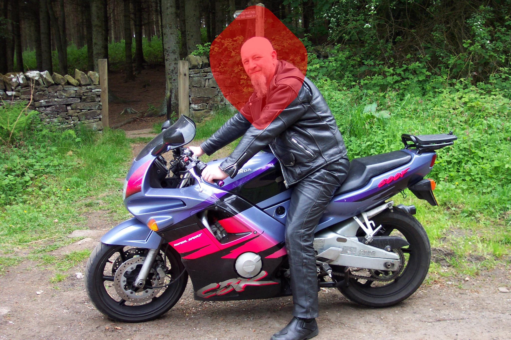
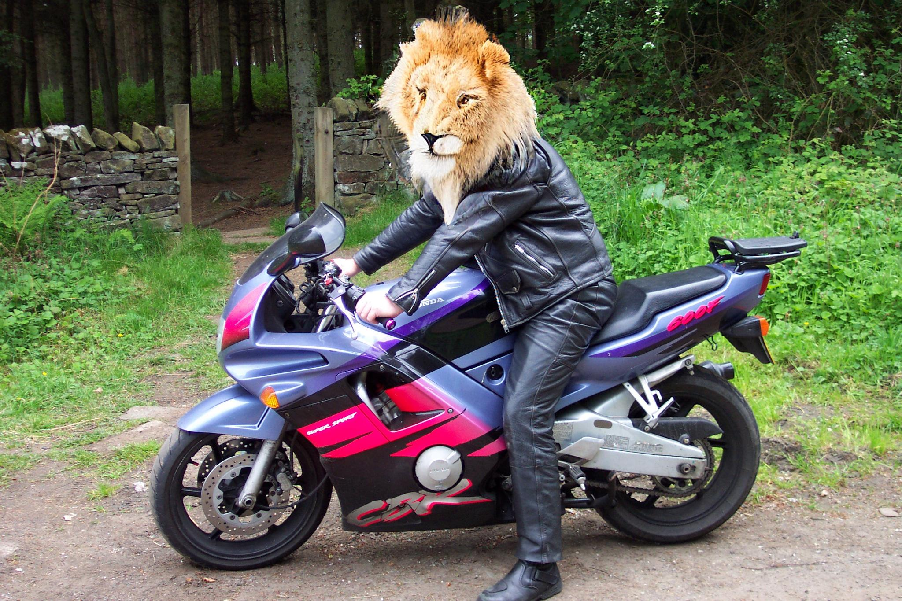
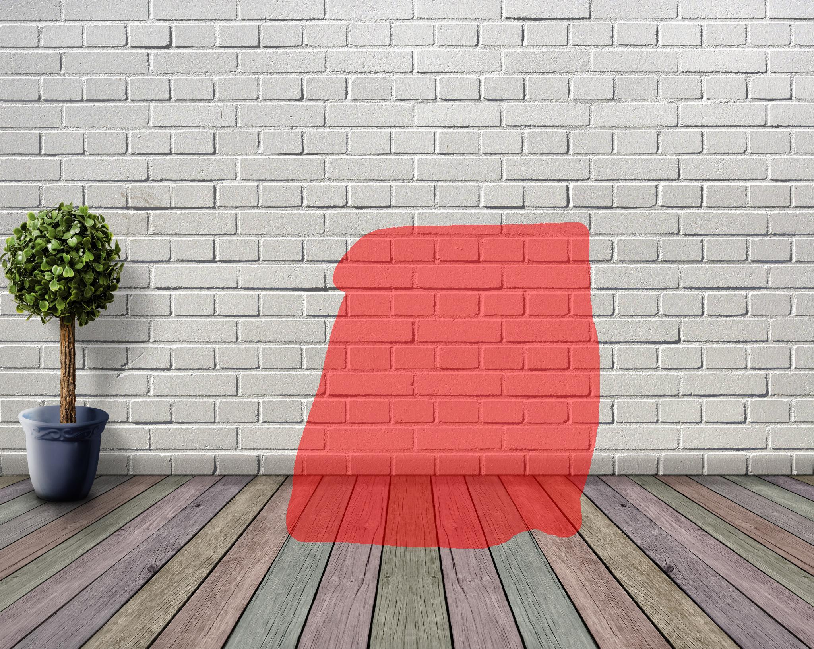
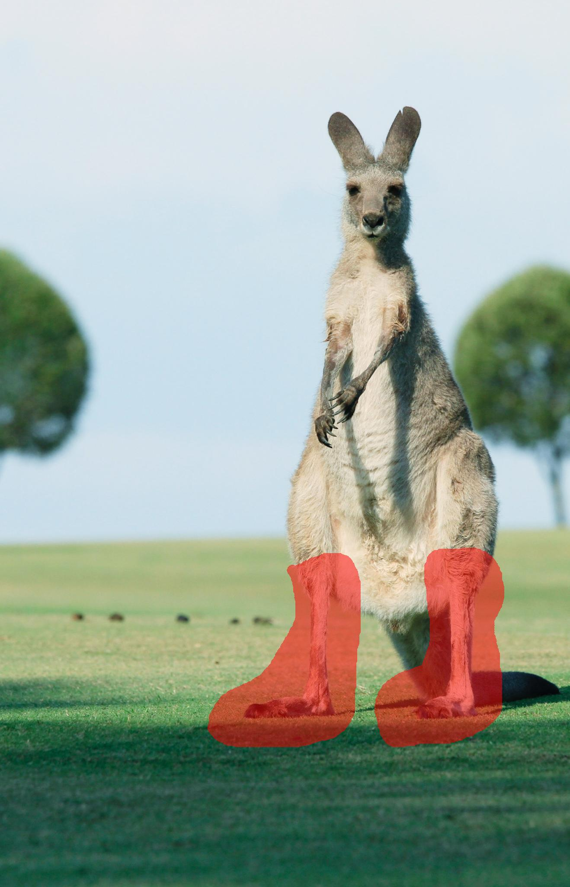
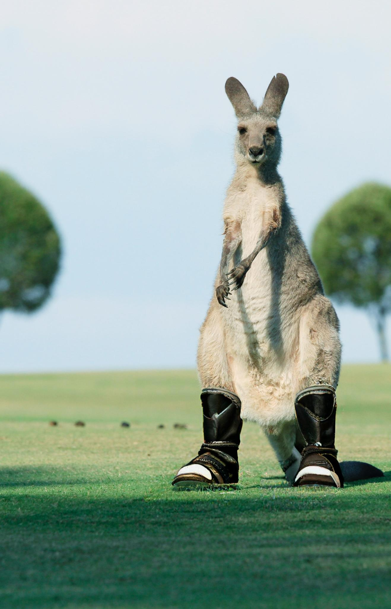

# HD-Painter

This repository is the official implementation of [HD-Painter](https://arxiv.org/abs/2312.14091).


**[HD-Painter: High-Resolution and Prompt-Faithful Text-Guided Image Inpainting with Diffusion Models](https://arxiv.org/abs/2312.14091)**
</br>
Hayk Manukyan*,
Andranik Sargsyan*,
Barsegh Atanyan,
[Zhangyang Wang](https://www.ece.utexas.edu/people/faculty/atlas-wang),
Shant Navasardyan,
[Humphrey Shi](https://www.humphreyshi.com)
</br>

[Paper](https://arxiv.org/abs/2312.14091) | [Video](https://www.dropbox.com/scl/fi/t4lnssa9wbkd3bqo9kzgs/HDPainterTeaserVideoV4.mov?rlkey=vuk2zwm4z4pngt73cdmpmumpv&dl=0) | [](https://huggingface.co/spaces/PAIR/HD-Painter)


<p align="center">
  
<br>
<em>
We propose the <strong>Prompt-Aware Introverted Attention (PAIntA)</strong> layer enhancing self-attention scores by prompt information and resulting in better text alignment generations. To further improve the prompt coherence we introduce the <strong>Reweighting Attention Score Guidance (RASG)</strong> mechanism seamlessly integrating a post-hoc sampling strategy into general form of DDIM to prevent out-of-distribution latent shifts.
Moreover, our approach allows extension to larger scales by introducing a specialized super-resolution technique customized for inpainting, enabling the completion of missing regions in images of up to 2K resolution. 
</em>
</p>

## Setup

To set up the environment, install requirements using Python 3.9

```
python3 -m venv venv
source ./venv/bin/activate
pip install pip --upgrade
pip install -r requirements.txt
```

If you would like to also perform metric evaluation, additionally install `mmcv` by running:

```
pip install mmcv==2.1.0 -f https://download.openmmlab.com/mmcv/dist/cu118/torch2.1/index.html
```

## Usage

You can use the following script to perform inference on the given image+mask pair and prompt:
```
python hd_inpaint.py \
  --model-id ONE_OF[ds8_inp, sd2_inp, sd15_inp] \
  --method ONE_OF[baseline, painta, rasg, painta+rasg] \
  --image-path HR_IMAGE_PATH \
  --mask-path HR_IMAGE_MASK \
  --prompt PROMPT_TXT \
  --output-dir OUTPUT_DIRECTORY
```
`--model-id` specifies the baseline model for text-guided image inpainting. The following baseline models are supported by the script:
- `ds8_inp` - DreamShaper 8 Inpainting
- `sd2_inp` - Stable Diffusion 2.0 Inpainting
- `sd15_inp` - Stable Diffusion 1.5 Inpainting

If not specified `--model-id` defaults to `ds8_inp`.

` --method` specifies the inpainting method. The available options are as such:
- `baseline` - Run the underlying baseline model.
- `painta` - Use PAIntA block as introduced in the paper.
- `rasg` - Use RASG guidance mechanism as introduced in the paper.
- `painta+rasg` - Use both PAIntA and RASG mechanisms.
 
If not specified `--method` defaults to `painta+rasg`.

The script uses combination of positive and negative text prompts by default for visually more pleasing results.

The script will automatically download the necessary models during first run, please be patient. Output will be saved in the `--output-dir` directory. Please note that the provided script outputs an image which longer side is equal to 2048px while the aspect ratio is preserved. You can see more options and details in `hd_inpaint.py` script.

## Gradio Demo

From the project root folder, run this shell command:
```
python demo/app.py
```

Then access the app [locally](http://127.0.0.1:7860) with a browser.
Please be patient: during first run models will be being automatically downloaded, which can take several minutes.

## Evaluation

From the root repository directory run the following commands to download and unzip MSCOCO validation images and annotations:
```
mkdir mscoco_data
cd mscoco_data
wget http://images.cocodataset.org/zips/val2017.zip
unzip val2017.zip
wget http://images.cocodataset.org/annotations/annotations_trainval2017.zip
unzip annotations_trainval2017.zip
cd ..
```

Then, use the following evaluation command for calculating the metrics of our method on MSCOCO validation set:
```
python metrics/eval.py --model-id ds8_inp --mscoco-dir ./mscoco_data --method painta+rasg
```
Change the `--method` if you want to perform an ablation study. You will need to save the `png` results of our method using `--save-png` option in above command, and then use `--pickscore-base-results-dir` option pointing to the saved png results directory of our method when evaluating other methods. Please see `metrics/eval.py` script for details and more options.

## Method



---  

## Results

<table class="center">

<tr>
  <td width=5% align="center" style="font-size: 120%">"yellow headphones"</td>
  <td align="center"></td>
  <td align="center"></td>
</tr>
<tr>
  <td width=5% align="center" style="font-size: 120%">"bench"</td>
  <td align="center"></td>
  <td align="center"></td>
</tr>
<tr>
  <td width=5% align="center" style="font-size: 120%">"lake"</td>
  <td align="center"></td>
  <td align="center"></td>
</tr>
<tr>
  <td width=5% align="center" style="font-size: 120%">"lion"</td>
  <td align="center"></td>
  <td align="center"></td>
</tr>
<tr>
  <td width=5% align="center" style="font-size: 120%">"leather couch"</td>
  <td align="center"></td>
  <td align="center"></td>
</tr>
<tr>
  <td width=5% align="center" style="font-size: 120%">"boots"</td>
  <td align="center"></td>
  <td align="center"></td>
</tr>
</table>


## BibTeX
If you use our work in your research, please cite our publication:
```
@article{manukyan2023hd,
  title={HD-Painter: High-Resolution and Prompt-Faithful Text-Guided Image Inpainting with Diffusion Models},
  author={Manukyan, Hayk and Sargsyan, Andranik and Atanyan, Barsegh and Wang, Zhangyang and Navasardyan, Shant and Shi, Humphrey},
  journal={arXiv preprint arXiv:2312.14091},
  year={2023}
}
```